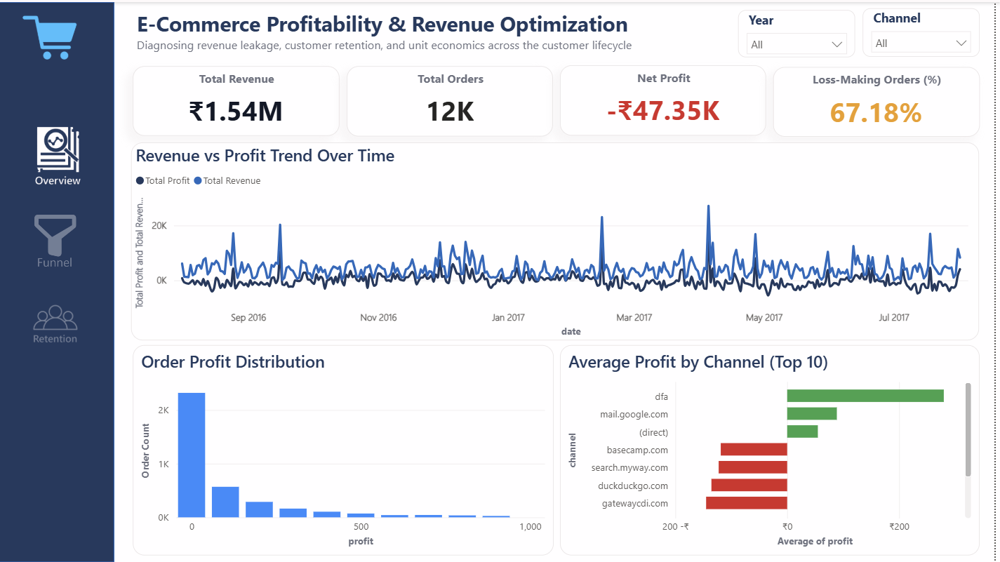
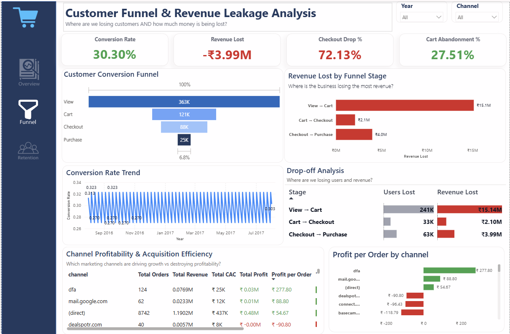
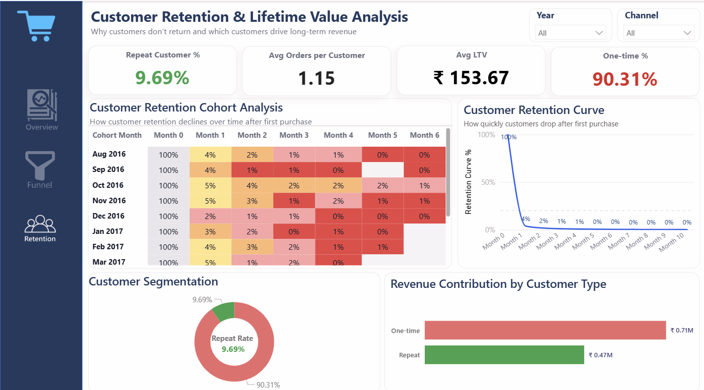

# E-Commerce Profitability & Funnel Analysis

This project analyzes customer conversion behavior, profitability, revenue leakage, and retention patterns for an e-commerce business using Python and Power BI.

The objective was to identify where the business loses revenue, evaluate marketing efficiency, and uncover customer behavior patterns impacting profitability and long-term growth.

## Business Problem

The business was experiencing:
- low funnel conversion
- revenue leakage during checkout
- weak customer retention
- inefficient acquisition spending

The project focused on identifying operational and behavioral inefficiencies affecting profitability and sustainable growth.

## Project Objectives

- Analyze customer funnel drop-offs
- Evaluate profitability at order level
- Identify revenue leakage points
- Study customer retention behavior
- Compare acquisition channel efficiency
- Build executive-level dashboards for decision-making

## Tools & Technologies

- Excel
- Python (Pandas, NumPy)
- Power BI

## Project Workflow

Excel → Python Analysis → Power BI Dashboarding → Business Insights

## Dashboard Preview

### Executive Overview



### Funnel Analysis



### Retention Analysis



## Key Analysis Performed

- Funnel conversion analysis
- Revenue leakage analysis
- Profitability and unit economics
- Customer segmentation
- Retention and repeat customer analysis
- Channel-level performance evaluation

## Key Insights

- Significant drop-off observed between product view and cart stages
- Revenue leakage exceeded realized revenue, indicating severe conversion inefficiency
- Majority of orders were loss-making due to acquisition costs and discounting
- Paid acquisition channels generated lower profitability
- Repeat customers contributed disproportionately higher customer value

## Business Recommendations

- Optimize checkout and payment flow to reduce funnel abandonment
- Shift focus from acquisition-heavy growth to retention-led growth
- Reevaluate discounting and acquisition spending strategies
- Improve lifecycle marketing for repeat customer conversion
- Prioritize high-performing acquisition channels

## Repository Structure

```text
data/
excel/
python/
powerbi/
images/
presentation/
documentation/
output/


---

# ✅ DOCUMENTATION

```markdown id="n5v4yr"
## Documentation

- Project Report
- Executive Presentation
- Data Dictionary
- Dashboard Screenshots

## Author

Preeti Malji  
Aspiring Data Analyst | Business Intelligence Enthusiast
